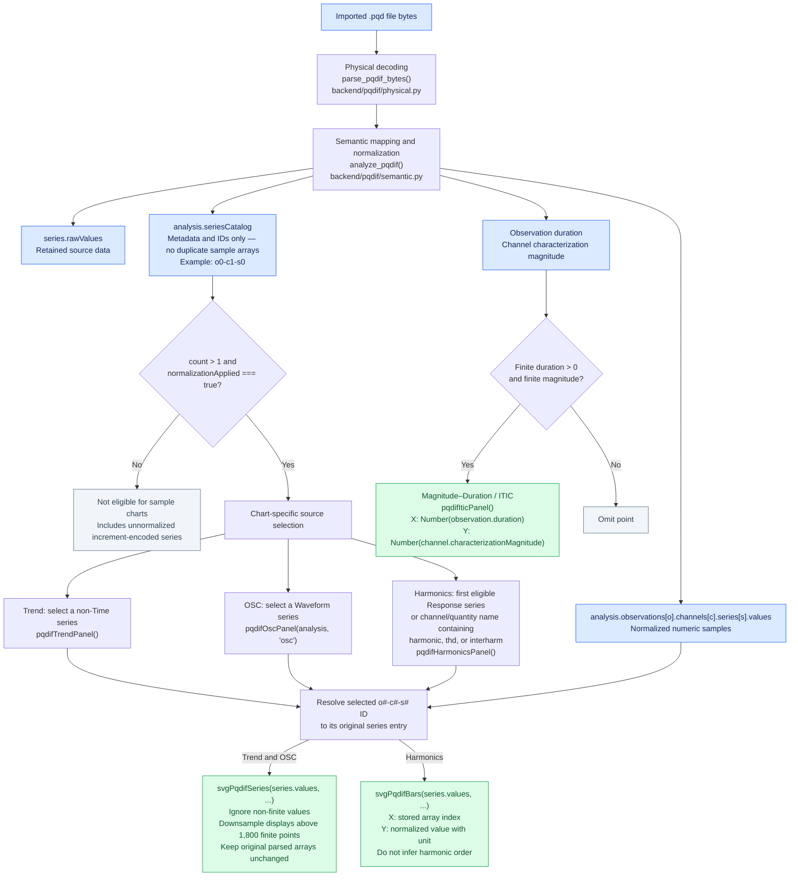
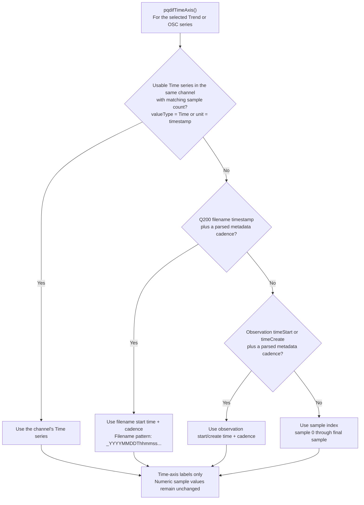

# PQDIF file-to-chart mapping

Based on `PQD_CHART_DATA_MAPPING (1).md`. This describes the architecture in that document; it does not assert that its Python backend and SVG frontend exist in this repository. Live Modbus/Q200 register charts, COMTRADE, CSV, and PDF are outside this flow.

## Data flow and chart routing

Scaling occurs in the semantic layer when the storage method requires it: `value = raw × scale + offset`. In the supplied document, increment-encoded series are retained raw and are not plotted. ITIC uses event metadata rather than `series.values`. OSC applies no additional RMS calculation, scaling, filtering, or waveform reconstruction beyond the renderer's finite-value filtering and display-only downsampling.

## Trend and OSC time-axis fallback

Cadence examples from the document include `Freq10s` and `10min`. The first usable source wins.

## Fixture examples reported by the document

These values are reported for `tests/fixtures/MES_Q200_SYNTHETIC_TEST.pqd`; they have not been independently verified here.

| Chart | Selected source | ID | Samples | Unit | Parsed range |
| --- | --- | --- | ---: | --- | --- |
| Trend | Ua 10min | `o0-c0-s0` | 36 | V | 228.8000–230.1968 |
| Harmonics | Ua Harmonics | `o0-c1-s0` | 25 | % | 0.04–100.0 |
| OSC | Ua Waveform | `o0-c2-s0` | 256 | V | -325.0–325.0 |
